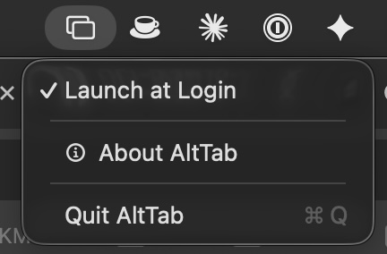
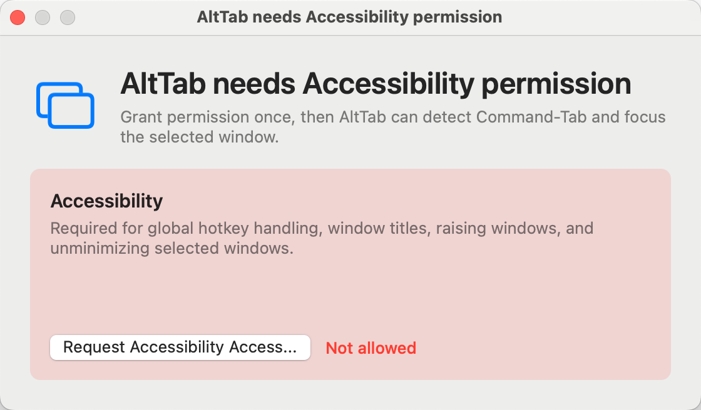

<p align="right">
  <strong>English</strong> | <a href="./README.zh-CN.md">简体中文</a>
</p>

<h1 align="center">AltTab</h1>

<p align="center">
  A small macOS window switcher that makes <kbd>Command</kbd> + <kbd>Tab</kbd> switch between windows instead of apps.
</p>

<p align="center">
  
  
  
  
  
</p>

<p align="center">
  
</p>

## Overview

AltTab is a menu bar utility for people who want the Windows-style window switching model on macOS. macOS normally uses Command-Tab to switch between applications; this app intercepts that shortcut while it is running and switches between individual windows instead.

The interaction is intentionally close to the native macOS app switcher:

- Tap <kbd>Command</kbd> + <kbd>Tab</kbd> quickly to switch to the next window without showing the switcher.
- Hold <kbd>Command</kbd> after pressing <kbd>Tab</kbd> to show the switcher and continue cycling.
- Release <kbd>Command</kbd> to activate the selected window.

This project is inspired by [sergio-farfan/alttab-macos](https://github.com/sergio-farfan/alttab-macos), then adapted around a simpler local build path and Command-Tab behavior.

## Highlights

- Overrides native macOS Command-Tab while AltTab is running
- Short Command-Tab tap switches immediately without opening the list
- Hold Command-Tab to show a non-activating switcher panel
- Includes regular and minimized windows
- Maintains MRU window order, including intra-app focus changes
- Uses Accessibility for titles, focus, raise, and unminimize
- Does not use Screen Recording permission or live window capture
- Builds with Command Line Tools and `swiftc`; no full Xcode project is required
- No third-party dependencies

## Requirements

| Requirement | Version |
| --- | --- |
| macOS | 13.0 or later |
| Build tools | Command Line Tools |
| Permission | Accessibility |

## Build And Install

Build only:

```bash
./build.sh build
```

Install to `~/Applications`:

```bash
./build.sh install
open ~/Applications/AltTab.app
```

Install to `/Applications`:

```bash
sudo ./build.sh install --system
open /Applications/AltTab.app
```

Run directly from the build directory:

```bash
./build.sh run
```

## Permissions

AltTab shows a small permission guide on first launch if Accessibility has not been granted yet. This permission is required to observe keyboard events and manage windows.

<p align="center">
  
</p>

Use the button in the guide, or grant it manually in:

```text
System Settings -> Privacy & Security -> Accessibility -> AltTab
```

Screen Recording is not required. The switcher displays app icons and window titles instead of live window thumbnails.

## Shortcuts

| Shortcut | Action |
| --- | --- |
| Tap <kbd>Command</kbd> + <kbd>Tab</kbd> | Switch to the next window immediately |
| Hold <kbd>Command</kbd> + <kbd>Tab</kbd> | Open the switcher |
| <kbd>Tab</kbd> while holding Command | Move forward |
| <kbd>Shift</kbd> + <kbd>Tab</kbd> | Move backward |
| <kbd>Left</kbd> / <kbd>Right</kbd> | Move selection |
| Release <kbd>Command</kbd> | Activate selected window |
| <kbd>Escape</kbd> | Cancel |
| <kbd>Enter</kbd> | Confirm |
| Click an item | Select that item |

## Build Script

| Command | Description |
| --- | --- |
| `./build.sh build` | Build a release app bundle with `swiftc` |
| `./build.sh install` | Install to `~/Applications` |
| `./build.sh install --system` | Install to `/Applications` |
| `./build.sh run` | Build and launch from the build directory |
| `./build.sh clean` | Remove build artifacts |
| `./build.sh diagnose-hotkeys` | Show whether native Command-Tab hotkeys are disabled |
| `./build.sh restore-hotkeys` | Restore native macOS Command-Tab hotkeys |
| `./build.sh uninstall` | Remove the user-level install |
| `./build.sh uninstall --system` | Remove the system-wide install |

## How It Works

AltTab installs a session-level `CGEvent` tap to observe Command, Tab, arrow, Escape, and Enter events. While the app is active, it also disables the native macOS Command-Tab symbolic hotkeys through the SkyLight private API so the system app switcher does not preempt the custom window switcher.

Window discovery combines `CGWindowListCopyWindowInfo` for visible windows and Accessibility queries for minimized windows. MRU ordering is updated through `NSWorkspace` app activation notifications and per-app `AXObserver` focused-window notifications.

Window activation uses Accessibility APIs to unminimize, raise, and focus the selected window.

## Recovery

If the app exits unexpectedly and macOS Command-Tab does not come back, restore the native shortcuts manually:

```bash
./build.sh restore-hotkeys
```

To inspect the current state:

```bash
./build.sh diagnose-hotkeys
```

## Project Layout

```text
AltTab/AltTab/
├── main.swift              # App entry point and hotkey restoration hooks
├── AppDelegate.swift       # Lifecycle, status item, and switcher orchestration
├── HotkeyManager.swift     # Global event tap and shortcut state machine
├── NativeCommandTab.swift  # Disable/restore native Command-Tab
├── WindowModel.swift       # Window enumeration and MRU tracking
├── WindowActivator.swift   # Raise, focus, and unminimize windows
├── SwitcherPanel.swift     # Floating switcher panel
├── ThumbnailView.swift     # Window item view
├── PermissionManager.swift # Accessibility permission flow
└── PreferencesMenu.swift   # Menu bar actions
```

## License

MIT. See [LICENSE](./LICENSE).
